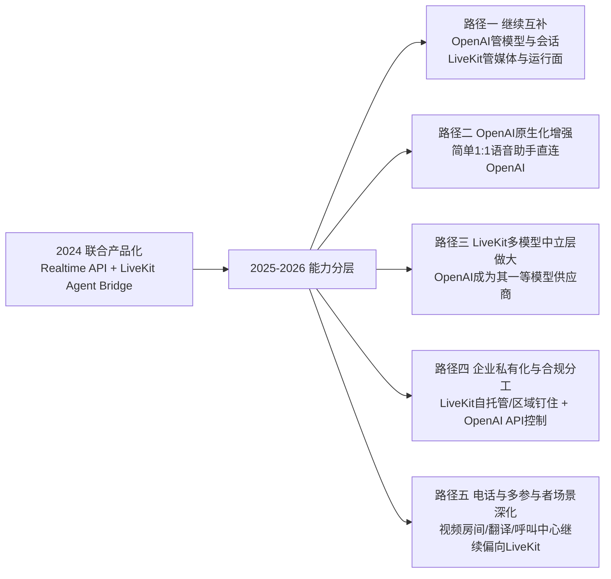

# OpenAI 与 LiveKit 合作研究报告

## 执行摘要

这项合作的公开事实可以概括为一句话：**OpenAI 提供实时语音模型与 API，LiveKit 提供面向终端用户场景的实时媒体传输、Agent 编排与部署运维层；但到 2025—2026 年，OpenAI 又逐步把部分实时媒体能力原生化，因此双方关系正在从“强耦合产品共建”演化为“能力互补、边界重画”的生态协作。** 公开材料中，LiveKit 在 2024 年明确宣布与 OpenAI 达成 partnership，并称开发者可以用到“与 ChatGPT Advanced Voice 相同的端到端技术”；OpenAI 官方则没有单独发布一篇公司合作新闻稿，而是通过 Realtime API、Voice Agents、WebRTC/SIP 文档与 2026 年工程文章，持续公开其自有实时语音能力栈。就“是否存在合作”而言，答案是**明确存在**；就“当前生产链路中 LiveKit 占比和边界”而言，**公开材料未完全明确**。

从战略视角看，OpenAI 在 2024 年选择 LiveKit，更像是**“有能力自建，但不必在最紧要的发布窗口里从零重做一遍浏览器到边缘的实时媒体层”**。这一判断并非双方明说，而是基于两类证据的推断：一方面，LiveKit 在合作公告中详细解释了为什么终端用户语音场景不能简单依赖 WebSocket，必须处理丢包、码率自适应、低时延回放、打断与时序同步；另一方面，OpenAI 到 2026 年公开披露其自建 WebRTC relay + transceiver 架构时，也明确说明了 Kubernetes、UDP 端口暴露、状态粘性、全球路由与时延抖动控制的复杂度。这说明 OpenAI 并不是“不会做”，而是**在 2024 年选择了更快、更稳妥的合作路径**。这部分结论属于分析性推断，而非任一官方直接表述。

对 LiveKit 而言，与 OpenAI 的合作意义并不只是一个大客户或品牌背书，而是一次**市场定义权的放大器**。2025 年 LiveKit 在 Series B 文章中回溯称，早在 2023 年 9 月就与 OpenAI 一起推出了 ChatGPT Voice Mode；同文还称 LiveKit Cloud 已支持超过 10 万开发者、每年超过 30 亿通话。到 2026 年，LiveKit 官网进一步把这一叙事前置为“OpenAI built ChatGPT’s Advanced Voice on LiveKit Cloud”。这些表述说明 OpenAI 已被 LiveKit 用作其“语音 AI 基础设施”合法性的核心证明。TechCrunch 也在 2025 与 2026 年两篇报道中复述了“LiveKit 为 OpenAI Voice Mode 提供底层能力”的说法。

但与此同时，**双方合作的独占性在下降**。OpenAI 现在已原生提供 Voice Agents、浏览器直连 WebRTC、SIP、Realtime Session、Tracing、EU data residency 等能力；LiveKit 则把重心继续上移与下移：上移到模型中立的编排层、Inference Gateway、Turn Detector、Observability；下移到电话、房间、多参与者视频、跨端 SDK、区域钉住、云托管与自托管的混合部署。换言之，**OpenAI 越来越像“实时语音模型与会话 API 提供商”，LiveKit 越来越像“多模型、多通道、多部署形态的实时 AI 应用操作系统”**。

本报告的事实核验优先使用双方官方资料；若官方资料未直接说明，则明确标记为“未明确”，并说明推断依据与不确定性。下表列出本报告最关键的原始来源与次级来源，引用标记本身即为可点击的来源链接。

| 来源层级 | 来源 | 用途 |
|---|---|---|
| OpenAI 官方 | Realtime API 发布公告  | 核验 Realtime API 上线时间、定位与架构变化 |
| OpenAI 官方 | Voice Agents 文档 ；WebRTC 文档 ；SIP 文档  | 核验 OpenAI 当前原生语音能力与接入路径 |
| OpenAI 官方 | 低时延语音工程文章  | 核验 OpenAI 已具备自建 WebRTC 基础设施能力 |
| OpenAI 官方 | 数据控制与 Realtime 开发者说明  | 核验保留策略、EU 数据驻留、Tracing |
| OpenAI 官方 | Realtime Translation Cookbook  | 核验 2026 年仍存在 LiveKit 官方示例集成 |
| LiveKit 官方 | 合作公告  | 核验 partnership、合作架构、Advanced Voice 叙事 |
| LiveKit 官方 | OpenAI 集成文档  | 核验桥接方式、插件、参数与 turn detection |
| LiveKit 官方 | Cloud / Pricing / Security / Privacy / Region Pinning 文档  | 核验商业模式、合规、部署与数据流 |
| LiveKit 官方 | Series B 与 Inference 公告  | 核验合作回溯、生态扩张与多模型战略 |
| 权威媒体 / 技术社区 | Reuters ；TechCrunch ；Software Engineering Daily  | 作为次级核对，补足行业背景、外部观察与市场定位 |

## 事实基线与合作时间线

首先必须澄清一个容易混淆的边界：**“OpenAI 与 LiveKit 有公开合作”是明确事实；“OpenAI 是否在 2026 年仍将全部 ChatGPT Advanced Voice 生产流量跑在 LiveKit Cloud 上”则未被双方用完全对称的官方口径完全说明。** LiveKit 官网与 TechCrunch 都给出了“OpenAI built ChatGPT’s Advanced Voice on LiveKit Cloud / LiveKit powers OpenAI’s ChatGPT voice mode”的表述；但 OpenAI 2026 年工程文又详细披露了其自建的 WebRTC relay + transceiver 架构。因此，更稳妥的表述是：**公开材料足以确认历史合作与技术整合，但不足以完全还原当前生产链路的责任边界、流量分配、合同结构与是否独占。** 

| 日期 | 事件 | 官方来源 | 影响评估 |
|---|---|---|---|
| 2023-09 | OpenAI 发布 ChatGPT 语音能力；LiveKit 在 2025 年回溯称“2023 年 9 月与 OpenAI 一起发布 ChatGPT Voice Mode” | OpenAI《ChatGPT can now see, hear, and speak》；LiveKit Series B 回顾  | 这是合作最早的公开时间锚点之一，但“合作共发布”这一点来自 LiveKit 的回溯披露，**OpenAI 未单独发合作公告** |
| 2024-10-01 | OpenAI 发布 Realtime API 公测，称开发者可构建类似 ChatGPT Advanced Voice 的低时延多模态体验 | OpenAI 公告 ；Reuters 报道  | OpenAI 把内部语音能力平台化，合作由“内部产品能力”转向“外部开发者能力” |
| 2024-10-03 | LiveKit 正式宣布与 OpenAI partnership，并发布内置 OpenAI Realtime API 支持的 Multimodal Agent API | LiveKit 合作公告  | 形成公开可见的联合叙事：OpenAI 提供模型与 API，LiveKit 提供端到端实时媒体层与开发框架 |
| 2024-12 | LiveKit 发布基于 transformer 的端点检测模型，解决语音 AI 中打断与回合判断问题 | LiveKit 工程博客  | 说明 LiveKit 不再只是“传输层”，而是在进入对话质量与人机交互层 |
| 2025-04-10 | LiveKit Series B 文中再次强调与 OpenAI 的历史合作，并称 LiveKit Cloud 支持超 10 万开发者、年 30 亿通话 | LiveKit Series B ；TechCrunch  | 合作转化为 LiveKit 的市场证明与融资叙事资产 |
| 2025-08-28 | OpenAI 发布 `gpt-realtime` 与 Realtime API GA：加入 MCP、图像输入、SIP 电话等能力 | OpenAI 公告  | OpenAI 语音 API 明显“原生化”，对第三方编排层的依赖开始下降 |
| 2025-10-01 | LiveKit 发布 Inference 统一模型网关，把 OpenAI 纳入其 LLM 供应商体系 | LiveKit Inference 公告  | 双方关系从“单一联合方案”变成“LiveKit 平台中的关键模型伙伴之一” |
| 2026-05-04 | OpenAI 公开其自建低时延语音基础设施：relay + transceiver，面向 9 亿周活规模 | OpenAI 工程文章  | 强力证明 OpenAI 已具备独立构建全球实时媒体基础设施的能力 |
| 2026-05-07 | OpenAI 发布新的实时音频模型与 Cookbook；示例中仍包含 LiveKit 视频房间翻译 demo | OpenAI Cookbook 与模型发布  | 表明在开发者生态层面，LiveKit 依然是 OpenAI 官方愿意展示的参考集成路径 |
| 2026-06 | LiveKit 官网仍公开写明“OpenAI built ChatGPT’s Advanced Voice on LiveKit Cloud” | LiveKit 官网  | 说明 LiveKit 仍把 OpenAI 作为头号标杆客户对外传播；但是否表示全部当前流量仍全部经由 LiveKit，**未明确** |

这条时间线显示的并不是一段线性的“甲方乙方外包关系”，而是一个**分层演进过程**：起初更像是 OpenAI 语音产品与 LiveKit 实时媒体能力的深度结合；随后 OpenAI 持续原生化 API 与实时接入方式，而 LiveKit 则扩展为多模型、多通道、多部署的 agent 平台。到 2026 年，合作仍在，但重心已经从“把 Advanced Voice 做出来”转向“如何在开发者和企业世界里把实时语音应用大规模跑起来”。

## 双方需求与供给

从能力拼图上看，OpenAI 与 LiveKit 的合作并不是简单的“模型厂商 + RTC 厂商”叠加，而是**模型层、会话层、媒体层、部署层与合规层**的分工。LiveKit 官方文档对这一分工的表达非常直接：LiveKit Agents 充当**“前端 WebRTC 与 OpenAI Realtime API WebSocket 之间的桥”**，自动把 Realtime API 的音频响应缓冲转成与文本同步的 WebRTC 音频流，并处理 interruption handling 等业务逻辑；而 OpenAI 官方则把 Voice Agents、Realtime Session、WebRTC、SIP、Tracing 与数据驻留能力逐步内置到了自己的开发平台。

### OpenAI 对 LiveKit 的需求

| 需求维度 | OpenAI 需要什么 | 公开依据 | 研判 |
|---|---|---|---|
| 技术 | 终端到边缘的低时延实时媒体传输，特别是弱网下比 WebSocket 更稳的客户端语音链路 | LiveKit 解释 WebSocket 不适合终端弱网音频，WebRTC 更适合终端场景 ；OpenAI 现在也推荐客户端优先用 WebRTC  | 2024 年这是合作核心价值；2026 年 OpenAI 已能自建，但 LiveKit 仍可降低工程负担 |
| 产品 | 跨平台 client SDK、房间语义、UI 组件、同步字幕、打断处理 | LiveKit 合作文与 OpenAI 插件文档  | 这类能力对开发者交付速度很关键，但不直接构成 OpenAI 的模型差异化 |
| 商业 | 把“ChatGPT Advanced Voice 同款体验”快速外部化给开发者 | LiveKit 合作公告中明言“give developers access to the same... technology”  | 有利于 OpenAI 在 DevEx 上放大 Realtime API 的 adoption |
| 生态 | 借助 LiveKit 的开源分发和开发者社区扩大 Realtime API 使用面 | LiveKit 开源仓库、官网开发者规模与生态叙事  | 强化 OpenAI 模型成为实时语音默认后端的机会 |
| 合规 / 交付 | 自托管、区域钉住、云托管、企业支持、可观测性等企业级能力补丁 | LiveKit Cloud / Self-host / Region pinning / Security / Insights 文档  | 这些往往不是模型公司最愿意自营的长尾企业交付工作 |

### LiveKit 对 OpenAI 的需求

| 需求维度 | LiveKit 需要什么 | 公开依据 | 研判 |
|---|---|---|---|
| 核心模型 | 高质量、低时延、可打断的语音模型与实时 API | OpenAI Realtime API、公测与 GA 文档  | 没有这一层，LiveKit 很难完成“逼真语音 agent”闭环 |
| 品牌背书 | ChatGPT Voice / Advanced Voice 作为标杆案例 | LiveKit 官网与 Series B 文章、TechCrunch 报道  | 这几乎是 LiveKit 最强的市场合法性来源之一 |
| 平台流量 | 开发者围绕 OpenAI API 构建 voice agents，从而带动 LiveKit Cloud / SDK / Observability / Telephony 使用 | OpenAI 官方文档与 LiveKit 集成文档、Cookbook 示例  | 双方存在明显的渠道互补 |
| 商业放大器 | 让 LiveKit 不只卖 RTC，而是卖“实时 AI 应用平台” | LiveKit Inference 与 Agent Platform 叙事  | OpenAI 为 LiveKit 从通信基础设施向 AI 平台升级提供了最佳用例 |
| 生态锁点 | 把 OpenAI 放进 LiveKit 的统一模型网关里，同时保持多模型中立 | LiveKit Inference 支持 OpenAI、Gemini、Groq 等  | LiveKit 需要 OpenAI，但不能只依赖 OpenAI，因此其长期策略是“拥抱但不绑定” |

### 双方实际供给清单

| 厂商 | 提供的产品 / 能力 | 关键细节 | 公开指标 / 说明 |
|---|---|---|---|
| OpenAI | Realtime API | 支持语音会话、翻译、转写；支持 WebRTC、WebSocket、SIP；提供 `gpt-realtime`、`gpt-realtime-2`、`gpt-realtime-mini`、`gpt-realtime-translate`、`gpt-realtime-whisper` 等模型  | `gpt-realtime-2` 音频输入 $32 / 1M tokens、音频输出 $64 / 1M tokens；翻译 $0.034 / 分钟；转写 $0.017 / 分钟  |
| OpenAI | Voice Agents / Agents SDK | 官方推荐对浏览器语音助手优先从 Voice Agents 与 RealtimeSession 开始，低层可直连 WebRTC | 文档明确写浏览器客户端推荐 WebRTC 而非 WebSocket，以获得更一致性能  |
| OpenAI | 数据与合规控制 | API 默认 abuse monitoring logs 可保留最长 30 天；合格客户可申请 Modified Abuse Monitoring / Zero Data Retention；Realtime 某些版本支持 EU data residency | 数据控制与 Realtime 开发者说明  |
| LiveKit | Open-source WebRTC server | Go 编写、基于 Pion；支持分布式 SFU、多区域、JWT、UDP/TCP/TURN、E2EE、Docker/K8s 部署 | 官方 GitHub README  |
| LiveKit | Agents SDK 与 OpenAI 插件 | Python / Node；插件支持 OpenAI Realtime、LLM、STT、TTS；自动 turn detection、interruption handling、function calling、load balancing | Agents 仓库与 OpenAI plugin 文档  |
| LiveKit | LiveKit Cloud | 全球分布式网格；托管 agent hosting、telephony、observability、inference、region pinning、自托管兼容 | 官方 Cloud 文档  |
| LiveKit | 性能与可扩展性 | 云平台宣称 99.99% uptime；自托管基准中，16 核实例可支撑音频房间约 10 发布者 / 3000 订阅者，CPU 约 80% | 官方 Cloud / Benchmark 文档；注意均为厂商自测或厂商声明  |
| LiveKit | 定价与商业模式 | Agent session $0.01/分钟；Telephony $0.01/分钟；Observability $0.01/分钟；另叠加模型推理费用；云计划含免费额度 | 官方定价页  |

一个重要结论是：**OpenAI 的供给越来越“原生”，LiveKit 的供给越来越“平台化”。** 如果用层次来画，OpenAI 正在覆盖“模型 + 会话 API + 部分接入层”，而 LiveKit 覆盖“媒体传输 + Agent 运行时 + 多模型网关 + 电话 + 可观测性 + 合规部署”。这意味着双方并非简单替代关系，而是**在简单单点语音助手场景中有更多重叠，在复杂企业与多通道场景中仍高度互补**。

## 为什么 OpenAI 选择 LiveKit

要回答这一节，必须先回答反问题：**OpenAI 本可自行完成哪些事项？** 以 2026 年公开能力倒推，答案是：OpenAI 显然有能力构建浏览器到模型之间的实时接入、全球 WebRTC 入口、会话初始化、SIP 电话能力，以及开发者侧的 Voice Agents 抽象。OpenAI 工程团队已经公开披露其为超过 9 亿周活规模重构了 WebRTC 媒体栈；其文档也已经提供浏览器直连 WebRTC 与 SIP 接入方案。换言之，从“技术能力”视角看，OpenAI **能做**；但从“2024 年的发布时间窗口、产品边界与机会成本”视角看，OpenAI 未必**值得立刻自己全做**。

### 替代方案、成本、时间与风险比较

> 说明：下表中的“成本 / 时间 / 风险”属于分析性判断，依据公开架构复杂度、产品边界和厂商能力做定性比较；**双方未公开合同条款、内部 ROI 或人力投入**。  

| 方案 | OpenAI 是否有能力自做 | 交付速度 | 工程成本 | 主要风险 | 与选择 LiveKit 相比的取舍 |
|---|---|---:|---:|---|---|
| 传统三段式 STT → LLM → TTS | 能 | 高 | 中 | 对话自然度、打断、端到端时延差；OpenAI 自己在 2024 推 Realtime API 就是为消除这类拼接痛点  | 适合非实时场景，不适合 Advanced Voice 级体验 |
| OpenAI 直连 Realtime + 浏览器 WebRTC | 现在明确能做 | 中高 | 中 | 需要开发者自己处理更多终端音频 UX、房间、多参与者、电话、观测与企业交付；对简单 1:1 场景最优 | 到 2026 年已是现实替代路径；但 2024 年成熟度与配套未必足够 |
| OpenAI 完全自建全球 WebRTC / relay / transceiver / 多端 SDK 体系 | 能 | 低 | 很高 | UDP 端口、状态粘性、全球路由、Kubernetes 适配、弱网体验、回放同步与开发者工具链复杂度高  | 长期可控，但 2024 年对发布时间窗口不友好 |
| 使用 LiveKit | 不必全做 | 高 | 中低 | 供应商边界管理、协议演进跟随、与 OpenAI 原生能力重叠后价值被压缩 | **最适合 2024 的速度优先策略** |
| 使用 Daily / Agora / Twilio / Cloudflare 等替代商 | 能选择 | 中 | 中 | 开源可移植性、AI 原生度、电话或多模型整合能力各不相同；与 OpenAI 叙事与联合生态不如 LiveKit紧密 | 是可行备选，但不一定同时满足“开源 + 可托管 + Agent 层 + 生态照应” |

更具体地说，OpenAI 在 2024 年选择把一部分事情交给 LiveKit，最有说服力的理由有四个。

其一，是**速度**。OpenAI 2024 年 10 月刚把 Realtime API 公测推向开发者，而 LiveKit 同时就发布了包裹这套 API 的 Multimodal Agent API，并把终端到 agent 的 WebRTC 传输、字幕与打断同步做成了开箱即用的开发框架。对于一个希望迅速让开发者“复制 ChatGPT Advanced Voice 体验”的公司而言，这明显比要求开发者直接面对底层实时媒体协议更快。

其二，是**终端弱网问题不是模型公司最想自己首先解决的问题**。LiveKit 在合作文中把原因讲得很透：OpenAI 与模型之间的 server-to-server 用 WebSocket 足够，但到终端用户那一段，WebSocket 不擅长处理 Wi‑Fi / 蜂窝网络下的丢包、时序与音频抖动；WebRTC 才是为这类实时媒体设计的协议。OpenAI 2026 年自己的工程文也反过来说明，这一层真正落地时远不只是“加个 WebRTC 支持”那么简单，而是涉及全球入口、负载均衡、UDP 暴露面和状态ful 会话所有权。**因此，把这件事交给已经做成熟的 LiveKit，本质上是在购买“成熟度”和“时间”**。这仍然是推断，但推断依据很强。

其三，是**OpenAI 想卖的是模型与 API，不一定想在当时就亲自卖完整的语音应用 PaaS**。即使今天 OpenAI 已经原生化了不少接入能力，它也仍主要围绕“模型、会话、工具、开发者 API”组织产品，而 LiveKit 把自己定义为“build, run, and observe AI agents”的完整平台，包括部署、扩缩容、可观测性、region pinning、telephony、自托管与云托管兼容。这种分层，恰好让 OpenAI 把开发者流量导向自己的模型，同时让 LiveKit 承担大量应用交付侧复杂度。

其四，是**合作本身能把 ChatGPT 的内部能力快速变成行业默认栈**。LiveKit 的叙事是“同款技术栈”；OpenAI 的叙事是“给开发者和我们自己同样的工具”。这两种叙事非常契合。结果是，LiveKit 为 OpenAI 提供了一个可扩散的参考架构，而 OpenAI 为 LiveKit 提供了一个足够强的“默认模型后端”地位。双方都在 2024 年的那个时间点获得了增长。

结论上，我认为 OpenAI 当时选择 LiveKit 的核心原因并不是“做不到”，而是：**在 2024 年的窗口期里，让 LiveKit承担最后一公里实时媒体与开发者交付层，是一项比完全自建更高 ROI 的决策。** 到 2026 年，这一选择的短期目标已经达成，OpenAI 也开始把更底层和更通用的能力原生化，于是合作关系自然从“强依赖”走向“选择性继续依赖”。

## LiveKit 的优势与竞争格局

LiveKit 的真正优势，不在于“它也能传音频”，而在于它把实时 AI 应用中最难组合的几层拼在了一起：**开源 WebRTC SFU、跨端 SDK、Agent 运行时、电话桥接、多模型网关、观测平台，以及云托管 / 自托管可切换的部署面**。这使它与只卖通话分钟、只卖 SFU 流量、或只卖电话 API 的竞争对手形成差异。官方 GitHub README 明确写出其 server 是基于 Go 与 Pion 的分布式 WebRTC SFU，支持 JWT、UDP/TCP/TURN、Docker/Kubernetes、多区域与 E2EE；Agents 仓库则把 product 面进一步扩展到 STT / LLM / TTS 混用、调度、RPC、电话与 turn detection。

LiveKit 的第二个优势，是**“开源 + 托管云 + 迁移可移植性”三者同时成立**。LiveKit Cloud 文档明确说它运行的是与开源版相同的 LiveKit server，应用可从开源迁移到 Cloud，也可从 Cloud 退回自托管；自托管的 Agents 还是容器化部署，并通过 WebSocket 出站注册，不需要向公网开放入站端口。对于企业客户而言，这一点非常重要：它既能让早期团队用托管云加速，又保留了对数据路径、区域与基础设施的控制选项。

第三个优势，是**围绕 voice AI 的接口不是单点 API，而是全生命周期平台**。LiveKit 在产品页上强调 Build / Run / Observe：用开源 SDK 写 agent 逻辑；把 agent 部署到全球数据中心网络；用 session replay、transcripts、trace spans 与 logs 观察会话。这与 OpenAI 官方当前更偏“模型+会话”的产品形态形成互补。LiveKit 还把 turn detection、noise cancellation、interruption handling 作为平台内置能力持续强化，并在 2025 年用蒸馏模型把中断率进一步压低。

第四个优势，是**社区与生态广度**。截至 2026 年 6 月，LiveKit GitHub 组织页显示其 `livekit` 仓库约 19.3k stars、`agents` 仓库约 11k stars；官网则宣称 300,000+ 开发者、年 billions of calls、300+ AI model integrations。这些数字当然带有厂商口径，但仍足以说明 LiveKit 已不再是一个边缘 RTC 项目，而是一个拥有显著开发者基盘的实时 AI 平台。

### 与主要竞争对手的对比

| 厂商 | 主定位 | AI agent 层能力 | 开源 / 自托管 | 延迟 / 规模公开口径 | 价格信号 | 主要强项 | 主要短板 |
|---|---|---|---|---|---|---|---|
| **LiveKit** | 开源 WebRTC + agent platform | 有，含 Agents SDK、OpenAI 插件、Inference、telephony、observability  | **有**，开源 server + Cloud + 自托管可切换  | 官方云口径：全球 mesh、99.99% uptime、自托管基准可到 10 speakers / 3000 listeners/room（16 核机） | Agent session $0.01/分，另加模型等费用  | 最完整的“实时 AI 应用平台”形态，且有开源可移植性 | 在 OpenAI 原生能力增强后，简单 1:1 场景的中间层价值可能被压缩 |
| **Daily** | Realtime voice/video SDK 平台 | 有 AI 叙事，但核心仍是实时音视频 SDK；AI agent 平台能力不如 LiveKit 一体化公开得那么强  | 官方公开页未强调 LiveKit 式完整开源可自托管路径 | 官方宣称 13ms median first-hop latency、75+ PoPs、2x faster connection times  | Audio-only $0.00036–$0.00099 participant-min；V/A $0.0015–$0.004 participant-min  | 明确披露 first-hop latency，RTC 体验成熟 | 平台化 agent 运行时、电话、观测、模型中立编排公开形态较弱 |
| **Agora** | 全球 RTC + Conversational AI Engine | 有，且直接打包 ASR/LLM/TTS 到会话费用中  | 非开源平台主导，企业交付强 | 官方宣称 <200ms global latency、99.999% uptime、80B 分钟/月  | Conversational AI Audio Task $0.10/分钟，前 300 分钟免费；RTC 另计约 $0.00099/participant-min 示例价  | 全球 RTC 网络和企业可靠性叙事很强 | 成本结构较重，且对希望保留开源可携性的团队吸引力弱于 LiveKit |
| **Twilio** | 电话 / 通信平台 | 有，但更偏电话侧接入；Media Streams 使用 WebSocket，把电话音频流送给你的服务器  | 非开源平台主导 | 默认区域 US1，也支持 IE1/AU1；更偏 telephony 而非原生 SFU agent 平台  | Media Streams $0.004/分钟外加 Voice 费用；Video $0.004 participant-min  | 电话、号码、企业通信接入成熟 | 对浏览器 / 多人 / 多模态 AI agent，不如 LiveKit 原生 |
| **Cloudflare Realtime** | Serverless SFU / TURN 基础设施 | agent 层很薄，更像原始媒体基础设施  | 平台托管，非 LiveKit 式完整 agent 框架 | 官方称运行在全球网络、hundreds of cities；无需关心区域与扩展  | $0.05/GB egress，前 1000GB 免费  | 原始 SFU/TURN 成本与全球边缘网络吸引力强 | 缺少 LiveKit 那样完整的 agent orchestration、telephony、observability 叙事 |

把上表放到合作语境里阅读，会出现一个很清晰的判断：**LiveKit 最不像 Twilio，也不完全像 Agora；它更接近“一个把 SFU、agent runtime、观察与多模型接入揉在一起的实时 AI 平台”。** 正因为这种组合，LiveKit 才能在 OpenAI 合作中扮演比“媒体转发厂商”更上游的位置。其护城河也主要不在单一网络性能数字，而在**平台完整性、开源可迁移性与开发者生态复用**。

另一方面，LiveKit 也并非没有压力。OpenAI 原生 WebRTC/SIP 的增强，意味着简单浏览器语音助手场景可以直接绕过 LiveKit；Agora 的 bundled AI pricing 对一些标准化呼叫中心场景更直接；Daily 在延迟口径上的公开度更高；Twilio 在企业电话系统的销售渠道和号码体系上更强。LiveKit 长期要守住的，不是“我也能接 OpenAI”，而是“**我能让复杂实时 AI 产品更快上线、更好运营、更易合规、且不被单一模型供应商绑定**”。

## 合规、部署、性能与争议

在法律与合规层面，双方最值得注意的不是“谁合规更强”，而是**数据在什么路径上流动、谁保留什么、保留多久、能否区域隔离**。如果采用 LiveKit bridge 模式，官方文档给出的链路是：前端通过 WebRTC 连到 LiveKit，LiveKit Agents 再通过 WebSocket 连 OpenAI Realtime API；LiveKit 会把 Realtime API 的音频缓冲自动转为同步的 WebRTC 音频流。如果采用 OpenAI 原生 WebRTC 模式，OpenAI 文档则建议浏览器直接通过 WebRTC 连 Realtime API，而应用服务器只负责 session 初始化或签发 ephemeral secret。对于简单 1:1 语音助手，这意味着可以减少中间环节；对于多参与者、视频房间、电话与企业运维场景，则 LiveKit 的价值更大。

在 LiveKit 一侧，合规模块比较完整。其 Security 页面列出 SOC 2 Type II、GDPR、HIPAA，并称 ISO 27001 / 27018 / PCI DSS 在进行中；Region pinning 文档则明确支持将流量限制在特定区域，以满足 telephony regulation 或 data residency 需求；Cloud 文档写明平台提供全球 mesh、托管 hosting、电话号码与 observability。更重要的是，LiveKit 同时提供 Cloud 与自托管的双形态，Agents 以容器运行，并由出站 WebSocket 注册，因此自托管部署并不要求将 agent 服务器直接暴露到公网。对于受监管行业，这是非常实用的架构属性。

在 OpenAI 一侧，API 数据控制比 ChatGPT 消费者产品更“企业化”。官方《Your data》说明 API 默认会生成 abuse monitoring logs，最长通常保留 30 天；合格客户可申请 Modified Abuse Monitoring 或 Zero Data Retention。Realtime 开发者说明又进一步指出，某些实时模型版本已支持 EU data residency，并要求显式启用和使用 EU 端点。这意味着，如果企业采用 OpenAI API + LiveKit 自托管 / 区域钉住方案，理论上可以把合规控制做得相当细。

LiveKit 的隐私边界则更细分。其 Privacy Policy 明确写道：LiveKit 不会用 identifiable personal data、prompts、transcripts 或 audio 训练自己的模型；当客户使用 LiveKit inference 功能时，LiveKit 只是将数据传给客户选定的第三方模型提供商，并且**不保留 inference inputs or outputs**。但是，如果启用 LiveKit Cloud 的 Agent Observability，音频录音、transcripts、traces、logs 等会在 LiveKit Cloud 中保留 30 天；免费 Build 计划还可将部分匿名化会话数据纳入 model improvement program，而付费计划不参与此计划。换言之，**“推理数据不留存”与“观测数据可留存”是两套不同开关**。

就部署模式而言，LiveKit 的优势非常明确：**云托管、Kubernetes、自托管、多区域都支持**；OpenAI 当前则更偏向“开发者用我们的 API 与会话接口，是否自建上层应用由你决定”。这也是为什么在高合规、高可观测、高自定义的企业语音场景中，LiveKit 仍然很有吸引力——它提供的是“应用运行面”的选择权，而 OpenAI 提供的是“模型与会话面”的能力。

性能方面，公开数字需要谨慎解读。LiveKit 在合作博客中称 Advanced Voice 可在约 300ms 级别响应，这是一个面向体验阈值的说明；在自托管 benchmark 中，16 核 GCP 机器可支撑大音频房间约 10 个发言者、3000 个订阅者，CPU 约 80%。这些都属于厂商自述而非独立评测。OpenAI 则没有像 Daily 那样公布一个整齐的全球 p50/p95 语音时延数字，而是从系统设计角度强调 9 亿周活场景下需要低且稳定的 media RTT、低 jitter 与低 loss，并通过 relay + transceiver 解决 UDP 暴露面与状态粘性问题。因此，本报告对双方性能的判断是：**LiveKit 的性能优势体现在复杂实时媒体系统的“交付成熟度”，OpenAI 的性能优势体现在模型与平台原生化后的路径缩短；二者的公开数字口径并不完全可直接横比。** 

已知问题与争议主要集中在三类。第一类，是**语音截断与音频播放不完整**。OpenAI 官方社区在 2024 年就出现 Realtime API 音频结尾被随机截断的讨论；LiveKit 侧 GitHub 也有针对 OpenAI Realtime 在 LiveKit 中“长音频话语播放不完整”的 issue；OpenAI 自己的 realtime console 仓库同样出现过跨平台音频中途停止的问题。说明这类问题并非某一方独占，而是实时语音链路在模型、播放器、事件同步与内容过滤之间的系统性脆弱点。

第二类，是**模型与协议演进导致的适配滞后**。例如 2026 年 5 月，LiveKit 社区 issue 明确提到 `gpt-realtime-2` 的响应项结构与 LiveKit 预期不完全一致，导致只播放第一段音频或不支持 preambles；这暴露出一个结构性事实：当 OpenAI 原生协议快速演进时，位于中间层的 LiveKit 必须跟进适配，期间就会出现支持窗口差。

第三类，是**生产化 voice agent 的提示词与长会话边界**。OpenAI 官方开发者说明提到 Realtime API 会在上下文打满后自动 truncation，并建议设置 retention ratio 以减少 cache bust；社区则在 2026 年公开抱怨实时语音场景的 instruction limit 过低，尤其是携带菜单、规则、语音修正和客户上下文的呼叫中心 agent。这个问题并不专属于 LiveKit 或 OpenAI，但会直接影响双方合作在企业场景中的上限。

综上，合作在合规与部署上是**可做企业级落地**的，在性能上是**可达生产级**的，在争议上则主要体现为**中间层适配速度与端到端实时语音复杂性**。这并不是合作失败的迹象，恰恰说明实时语音 agent 还处在快速迭代期。

## 未来演变、关键结论与建议

从现在往后看，我认为双方最可能出现的不是单一路径，而是并行分化。下面的 Mermaid 图展示了我认为最合理的演化框架；其中每条路径都对应不同触发条件与产业后果。该判断基于 OpenAI 已原生提供 Voice Agents / WebRTC / SIP、LiveKit 已扩展到 Inference / Telephony / Observability / 自托管，以及双方各自对“平台边界”的公开表述。

### 合理的演化路径

| 演化路径 | 触发条件 | 对 OpenAI 的影响 | 对 LiveKit 的影响 | 对行业的影响 |
|---|---|---|---|---|
| 继续互补 | 企业客户仍然需要电话、房间、多模态同步、可观测性、区域钉住、自托管 | OpenAI 继续专注模型/API，减少应用层长尾交付负担 | 维持“OpenAI 最佳部署层”地位 | 形成“模型原生 + 第三方运行面”常态结构 |
| OpenAI 原生化进一步增强 | OpenAI 继续把 WebRTC、前端 helper、telephony、observability 做进官方平台 | 获取更高毛利与更强 DevEx 控制力 | 在简单 1:1 场景被边缘化 | 中间层厂商价值上移，基础接入层价格下压 |
| LiveKit 多模型中立层做大 | 企业不愿绑定单一模型商，要求切换 OpenAI/Gemini/xAI/Groq / 自带 key | OpenAI 成为重要但非唯一后端 | 平台价值增强，对单一模型依赖降低 | 多模型编排层成为新基础设施类别 |
| 企业私有化与合规分工 | 数据驻留、HIPAA、区域隔离、自托管需求上升 | OpenAI API 更像受控能力组件 | LiveKit 借 self-host / region pinning 赢企业项目 | 合规成为实时语音 agent 的核心竞争轴 |
| 电话 / 多参与者 / 翻译深化 | 视频房间、实时翻译、会议、呼叫中心等场景增长 | OpenAI 增加模型调用量 | LiveKit 继续占据上层运维与媒体协同优势 | 语音 AI 从单人助手走向“多方实时工作流” |

我认为概率最高的主路径是**“互补持续，但边界重心上移”**。原因很简单：OpenAI 已经证明自己能提供直连 WebRTC 与自建语音基础设施，因此不再需要 LiveKit 替它完成所有接入层工作；但 LiveKit 在多模型中立、自托管、电话、房间、多参与者与运维可观测上的投入，恰恰是 OpenAI 未必愿意亲自完全做深的地方。也就是说，**双方未来最稳的合作方式，不是更紧，而是更清楚地分层。** 

### 关键结论

第一，**这不是“真假合作”的问题，而是“合作边界如何演化”的问题。** 合作在 2024 年已经被 LiveKit 明确公开，2025—2026 年依然能从官方集成文档、Cookbook 示例和 LiveKit 官网叙事中看到延续；但 OpenAI 官方更强调自己的语音 API 原生能力，而非单独宣传某家实时媒体合作伙伴。

第二，**OpenAI 选择 LiveKit 的决定，在 2024 年更像一项“上市时间与复杂度管理”决策，而不是能力缺口决策。** OpenAI 此后自建 WebRTC 栈的事实，反而验证了这点：它终究会自己做，但不需要在合作启动那一刻就全部自己做。

第三，**LiveKit 的长期防守位不在“OpenAI 适配器”，而在“实时 AI 平台层”**。谁只把它看成 OpenAI 的桥接件，谁就会低估它在部署、观测、电话、区域、开源迁移与多模型网关上的价值；但如果 LiveKit 未来不能把这些非模型能力持续做厚，它在 OpenAI 原生化加速后也确实会被压缩。

### 可操作建议

| 对象 | 建议 | 依据 |
|---|---|---|
| OpenAI | 把“直连 OpenAI”与“通过 LiveKit 扩展”做成官方架构决策树，并在文档中明确适用场景边界，例如 1:1 浏览器语音优先直连，多参与者 / 电话 / 自托管优先参考 LiveKit | 当前 OpenAI 文档已原生支持 WebRTC/SIP；Cookbook 仍给出 LiveKit 示例，但两者之间缺一份明确决策框架  |
| OpenAI | 在 Realtime 协议升级时提供更稳定的兼容层与更清晰的变更说明，减少中间层与生态集成商的适配滞后 | `gpt-realtime-2` 的生态适配 lag 与社区问题说明协议演进成本正在外溢  |
| OpenAI | 继续强化企业级数据控制、区域驻留与 tracing，并公开更多与 third-party runtime 协作的最佳实践 | 企业采用门槛越来越来自合规与观测，而不只是模型能力  |
| LiveKit | 把“OpenAI 同款”叙事逐步升级为“多模型实时 AI 运行面”叙事，避免品牌价值过度捆绑单一伙伴 | LiveKit 已经通过 Inference 支持多家模型提供商，这应成为更强的战略主线  |
| LiveKit | 缩短对 OpenAI 新模型与新协议的支持时差，把兼容性做成 SLA 或至少做成公开路线图 | 生态问题集中暴露在协议演进适配与新模型支持滞后上  |
| LiveKit | 在合规与私有化市场上继续做深 region pinning、自托管 observability、数据最小化与审计能力，把这些做成对 OpenAI 原生链路的差异化壁垒 | 这是 OpenAI 原生能力最难完全替代、且企业最愿意付费的部分  |

**总判断**：截至 2026 年 6 月，OpenAI 与 LiveKit 的合作仍然是实时语音生态中最有代表性的“模型层 + 媒体/运行层”组合之一；不过它已经不再是 2024 年那种“没有彼此就很难完成体验”的状态，而更像是“彼此都能独立增强，但合作仍能显著降低开发者与企业客户的交付复杂度”的成熟关系。对于市场而言，这种关系演化本身，就是实时 AI 基础设施从早期拼装走向中期分层的标志。
