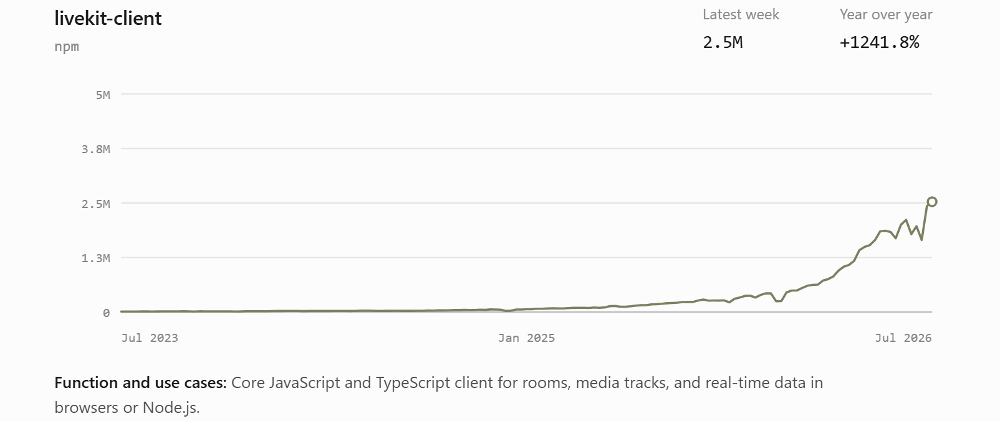

# Agora — Key Takeaways

### Background

This work is intended both to study Agora and to experiment with using more AI architectures and a broader set of AI tools in fundamental company research. Agora operates in a highly specialized technical field, where knowledge and information circulate within a relatively small community, while B2B businesses also have a high barrier to understanding. The research process around RTC has been interesting in its own right: it has offered a chance to explore better ways to use AI's analytical and execution capabilities, while also highlighting some of AI's limitations in investment research. I am still working to develop as objective a view of the company as possible, so I am sharing both the positives and the negatives. This is not investment advice.

### Agora's Core Investment Thesis

#### Bull Case

1. The company's main source of revenue has shifted overseas. In particular, [livestream commerce in the United States](https://agora.zhemin.ltd/Demand/US_Livestream_Commerce_Growth/) is currently a relatively stable source of growth and aligns well with the company's [competitive strengths](https://agora.zhemin.ltd/Agora/Whatnot_Agora_Partnership/).
2. The rise of AI voice applications is driving an explosive increase in [demand for RTC](https://agora.zhemin.ltd/Demand/Dev_npm_downloads/). Agora may not have a clear competitive advantage over major AI companies or LiveKit, but when demand is surging, providers in technically demanding fields can still capture some incremental growth.
3. The past issues of high stock-based compensation and [excess headcount](https://agora.zhemin.ltd/Agora/Employee_Headcount_Changes/) have improved. Free cash flow has turned positive, and operating profit may follow. The company has more net cash on its balance sheet than its market capitalization, providing a margin of safety.
4. Over the past four quarters, average share repurchases have represented more than 12% of total shares outstanding, and a potentially significant repurchase by a major shareholder may also be forthcoming.

#### Risk Factors

1. In an era when AI is substantially reducing software development costs, RTC services must become deeper and more specialized to leave room for commercial profitability. Independent RTC providers face a difficult squeeze: open-source software is eating into the market from above, while low-cost RTC offerings from large technology companies are pressing on their viability from below.
2. AI voice applications are growing explosively, but their requirements at the communications layer differ from those of livestream commerce and social applications. Agora's competitive strengths in high-concurrency scenarios may not align well with the needs of AI voice applications.
3. Agora invested approximately $277 million to build its headquarters campus in Shanghai, but the estimated [return](https://agora.zhemin.ltd/Agora/Shanghai_Headquarters_Construction_Analysis/) appears relatively low. The implicit costs of operating a business in China also need to be considered.

### RTC Demand Is Returning to Growth

Demand for RTC grew rapidly during the pandemic, benefiting from conference calls, working from home, and at-home entertainment. A significant amount of capital also flowed into the market during that period.

For example, when Agora went public in 2020, it raised $402.5 million by selling shares at $20 each and issuing additional shares. Its stock closed at $44.99 on the first trading day, implying a market capitalization of approximately $5 billion. Zego, a Chinese RTC company, raised $50 million in November 2020 at a market-estimated valuation of slightly more than $400 million. It raised another $100 million in 2022, although the valuation was unclear. Overseas during the same period, Zoom's share price rose sharply, and some large companies, including Amazon, also moved into this specialized market.

After 2023, competition in the industry began to cool. Apart from LiveKit, which rose alongside AI and completed several financing rounds, most companies did not raise new funding. Some smaller RTC providers also began shutting down or leaving the industry.

On the demand side, Agora's data actually shows that minutes have grown while revenue has declined over the past several years—in other words, volumes are up but prices are down. Over the past two years, one major driver has been the **growth of AI voice applications**, which has brought an explosive increase in downloads of RTC B2B [developer SDKs](https://agora.zhemin.ltd/Demand/Dev_npm_downloads/).

For example, downloads of the LiveKit npm package, used to build real-time voice AI, phone agents, and low-latency multimodal interaction services, have increased substantially. This data is connected to the current AI startup wave: many products may still be at the demo or other early stages, far from reaching steady-state operations. AI coding capabilities have also significantly lowered the technical barrier for many founders.

At the same time, demand for [livestream commerce overseas](https://agora.zhemin.ltd/Demand/US_Livestream_Commerce_Growth/) and social entertainment is steadily climbing. For example, eMarketer has estimated the value of U.S. livestream commerce transactions. The rise of TikTok Live has also increased user demand in livestream commerce. Independent livestream commerce platforms such as Whatnot have emerged and achieved impressive growth.

### Changes on the Supply Side of RTC

The supply side has also changed significantly. Broadly speaking, it can be divided into three stages:

- **Stage 1 (2020–2021):** Zoom Video SDK, Azure Communication Services, Huawei Cloud SparkRTC, 100ms, Dyte, and LiveKit. The pandemic drove a surge in communications demand, including conference calls and online education.
- **Stage 2 (2022–2023):** Volcano Engine, StreamLake, Cloudflare, Dolby/Millicast, Mux, and AWS IVS. Use cases expanded into livestream commerce and interactive viewing.
- **Stage 3 (2024 to present):** There have been no new entrants, but nearly all incumbent RTC providers have expanded into AI voice applications. LiveKit has executed this transition particularly well.

LiveKit has been the biggest supply-side variable over the past two years. It uses open source as a business strategy, widening the top of the funnel and attracting enough developers to use its codebase for free while building AI and voice products. It then uses LiveKit Cloud as the narrow end of the commercialization funnel to generate revenue. Its product is also well aligned with the current requirements of AI voice applications:

- Low latency, without requiring extremely high concurrency.
- Integration with AI models, creating value in AI voice workflows such as front-end noise reduction and process orchestration while quickly lowering the development barrier for developers.
- More attractive pricing than traditional RTC providers during the early stages of a startup.

LiveKit is also one of OpenAI's more publicly known infrastructure partners for AI voice applications. The [historical evolution of their relationship](https://agora.zhemin.ltd/Supply/OpenAI_LiveKit_Relationship/) itself illustrates how limited the room for independent RTC providers may be.

#### AI's Impact on the RTC Industry

In this article, I identify several problems that RTC providers need to solve and distinguish between those where AI can substantially improve efficiency or provide a solution and those that remain relatively difficult for now. I am not a technical expert in this field, so there are certainly errors in this analysis.

In simple terms, AI is driving a major expansion in data-center infrastructure. At the hardware level, this means RTC providers may not need dedicated infrastructure; using spare capacity from infrastructure built for other mainstream workloads may be enough to meet RTC requirements. Cloud providers may therefore be willing to give away low-complexity RTC services. Meanwhile, the supply of open-source RTC services is increasing, partly because AI has sharply reduced the cost of software-layer development and assembly. In this environment, the value of a senior RTC engineer may be amplified significantly by AI: a project that once required a team and several months of work might now be completed by one expert who knows how to use AI effectively.

Some scenarios still require deep RTC expertise—for example, RTC across regions and under weak-network or high-concurrency conditions. These capabilities depend on years of accumulated experience in error correction and on proprietary data. The barrier remains high, and this work cannot be easily replaced by AI.

### Agora's Competitive Position

There is relatively little public information about competition in this industry, so Agora's competitive strengths have to be inferred from a variety of clues. Usually, only early-stage startup teams publicly share their experiences, but because of their demand profiles, these companies are not Agora's primary sources of revenue. They are still useful as a reference for potential future revenue sources. Based on some [public examples of customers moving away from Agora](https://agora.zhemin.ltd/Agora/Customer_Scenarios_Competitive_Analysis/#%E4%BB%8Eagora%E8%BF%81%E5%87%BA%E5%85%AC%E5%BC%80%E7%A4%BE%E5%8C%BA%E6%A1%88%E4%BE%8B), the main reasons cited by startup teams include a mismatch with their requirements and high prices.

Medium-sized and larger companies with genuine needs for high concurrency, weak-network performance, and interactive features generally do not publish their experiences or decision-making tradeoffs. Agora does provide some case studies, but I assign them a low weight because they are the company's own marketing materials. The case that currently best demonstrates [Agora's competitive advantages](https://agora.zhemin.ltd/Agora/Whatnot_Agora_Partnership/) is an article on Whatnot's own engineering blog, which highlights Agora's strengths in large-scale interactive livestreaming. Reading the case also brings to mind the spectacle of YY's early days, when more than a thousand people could share a single voice channel during large-scale World of Warcraft battles.

Livestream commerce is highly compatible with Agora's competitive strengths. Whatnot, a rapidly growing U.S. livestream commerce platform in recent years, has steadily raised financing and its valuation while beginning to expand into Europe. It is focused on running livestream commerce operations well and lacks the infrastructure capabilities of a company like TikTok, so it may remain in a relatively long honeymoon period with Agora. The rise of this use case in Europe and the United States should also provide Agora with relatively stable growth.

Whatnot's financing rounds and valuations:

| Date | Financing round | Amount raised (USD) | Public valuation (USD) | Notes |
| --- | --- | --- | --- | --- |
| December 2020 | Seed | Approximately $4M | Undisclosed | Early investors including YC and a16z participated ([The Brand Hopper](https://thebrandhopper.com/featured-startups/whatnot-founders-business-model-funding-competitors/?utm_source=chatgpt.com)) |
| March 2021 | Series A | $20M | Undisclosed | Led by a16z ([Clay](https://www.clay.com/dossier/whatnot-funding?utm_source=chatgpt.com)) |
| May 2021 | Series B | $50M | Undisclosed | Led by YC Continuity ([Clay](https://www.clay.com/dossier/whatnot-funding?utm_source=chatgpt.com)) |
| September 2021 | Series C | $150M | **$1.5B** | Became a unicorn; first public disclosure of its valuation ([TechCrunch](https://techcrunch.com/2021/09/16/whatnot-raises-another-150m-for-its-livestream-shopping-platform-evolves-into-a-unicorn/?utm_source=chatgpt.com)) |
| July 2022 | Series D | $260M | **$3.7B** | More than doubled its Series C valuation; led by DST Global, CapitalG, and others ([TechCrunch](https://techcrunch.com/2022/07/21/whatnot-valuation-livestream-shopping/?utm_source=chatgpt.com)) |
| January 2025 | Series E | $265M | **Approximately $4.97B** | The new financing round pushed the valuation close to $5 billion ([The Information](https://www.theinformation.com/briefings/tiktok-shop-competitor-whatnot-boosts-valuation-to-5-billion?utm_source=chatgpt.com)) |
| October 2025 | Series F / new financing | $225M | **$11.5B** | Public reports indicated that the post-money valuation reached $11.5 billion ([The Information](https://www.theinformation.com/briefings/livestream-shopping-app-whatnot-boosts-valuation-11-5-billion?utm_source=chatgpt.com)) |

#### Improving Operating Performance

Agora went public during an industry boom, and the proceeds from its IPO exceeded its market capitalization at the time. During the bubble, it overspent across the board, including on:

- Headcount, which reached 1,311 employees in 2021;
- Approximately $177 million spent in 2022 to acquire land and build an office campus in Shanghai's Yangpu District;
- High levels of stock-based compensation that continued through 2024 Q3.

The capital markets also recognized the potential of the RTC industry during the boom and were willing to fund it. For example, Zego raised $50 million in 2020 from Tencent, IDG, Qiming Venture Partners, and others, followed by $102 million in 2022. These financings indicated that competitive intensity would rise in the future. Combined with the deterioration of China's broader economic environment since 2022, this helps explain why Agora's revenue reached a historical high in its first post-IPO earnings report, in 2021 Q3, before declining steadily and bottoming out in 2024 Q3.

In 2024 Q4, Agora's overseas revenue exceeded its domestic revenue for the first time—it began catching fish where the fish were. In 2025 Q2 and Q3, overseas DBNRR was 108% and 109%, respectively. I believe that in highly competitive domestic industries such as e-commerce, consumer electronics, and automobiles, leading companies and management teams are world-class. After leveling up in China's brutally competitive proving ground, they need to go overseas to find their gains and profits.

In 2025, headcount was reduced to 543 employees, down 58.6% from the peak. Stock-based compensation has been kept below $2 million per quarter since 2024 Q4. Operating profit remains negative, but the loss has narrowed substantially and is now close to breakeven.

#### AI, Voice, and Agora

STT (speech-to-text) models allow devices to understand human speech more accurately, while LLMs help machines better understand the meaning behind what people say. Together, they will significantly change how people interact with computers and phones. Voice input is becoming an increasingly important way to write code in the era of vibe coding. Once you have experienced convenient voice input and AI-assisted workflow orchestration, going back to typing can feel extremely frustrating. Short words, accents, and language switching still cause frequent errors, but most of these issues will likely be resolved over time. A large touchscreen paired with a good microphone may become the dominant way people work in the future.

AI has now dramatically lowered the barrier to writing code, which in turn has lowered the barrier to starting a software company. With AI's strong support for voice applications, a wave of startups in the AI voice sector is highly likely to emerge. Real-time audio and video transmission is an unavoidable foundational service, and Agora has also seen a meaningful increase in SDK downloads ([data chart](https://agora.zhemin.ltd/Demand/Dev_npm_downloads/)). In the short term, this will most likely show up in Agora's financials as costs growing faster than revenue. Many startups will use the 10,000 minutes included free each month, and many new products may fail before they ever generate revenue for Agora.

Over the long term, AI will have a profound impact on the software industry, but the pace of progress is currently so rapid that it is difficult to see clearly where things are headed. Agora's advantages in specialized scenarios such as high concurrency and weak-network conditions are to a significant extent based on software engineering capabilities. However, those capabilities also depend on years of practical experience and accumulated data. AI may need to advance for quite some time before it can gradually catch up.

### A Few Speculations

AI will significantly reduce the cost of digital assets. High-quality AIGC content on Douyin is an obvious example. I recently tried using Tripo to generate 3D models, and the quality was high while the cost was lower than buying a model from the Unity Asset Store. A major expansion in digital assets may make previously impractical projects feasible.

In the past, hiring a 3D modeling engineer required substantial time to create a high-quality model for a film or game. Thinking back to the real-world results of Meta's VR metaverse push, the childish avatars and cartoonish environments were not very compelling. Even today, the cost of VR and 3D games still has to be cut substantially because of the need to achieve an acceptable return on investment. You might see roadside cats in a game that all look exactly the same because the game developer bought the same $50 3D model from Unity; it would not make economic sense to hire a modeling engineer just for a single environmental detail.

As AI drives down costs and improves productivity, however, the quality and experience of VR assets could rise significantly. If large numbers of users were able to talk and interact in real time within a high-quality VR space, demand for RTC infrastructure could eventually become enormous.
